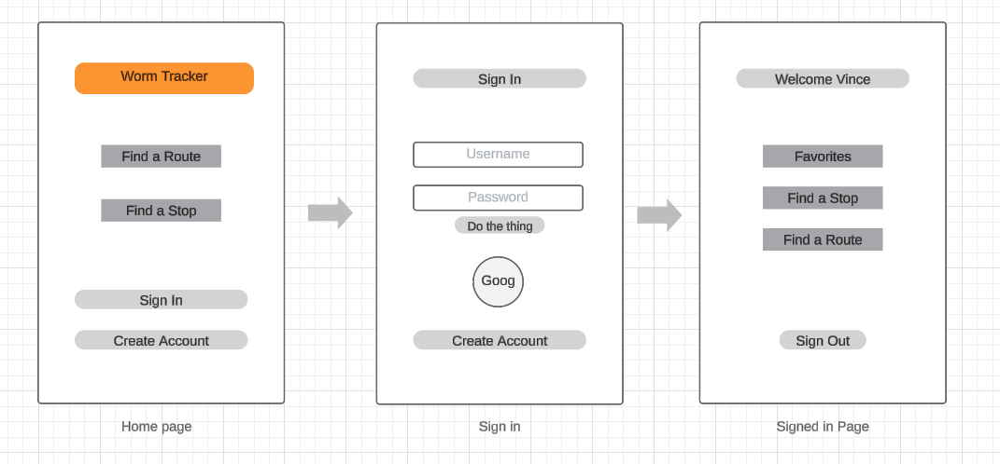
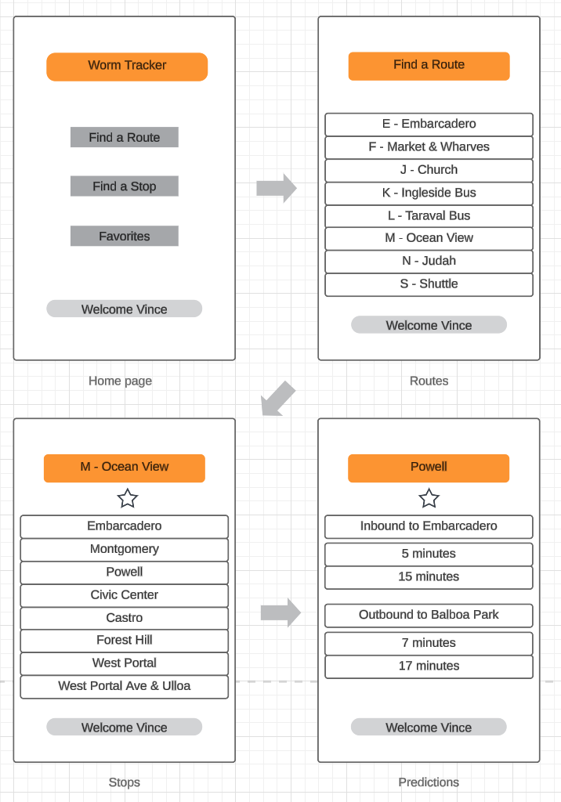
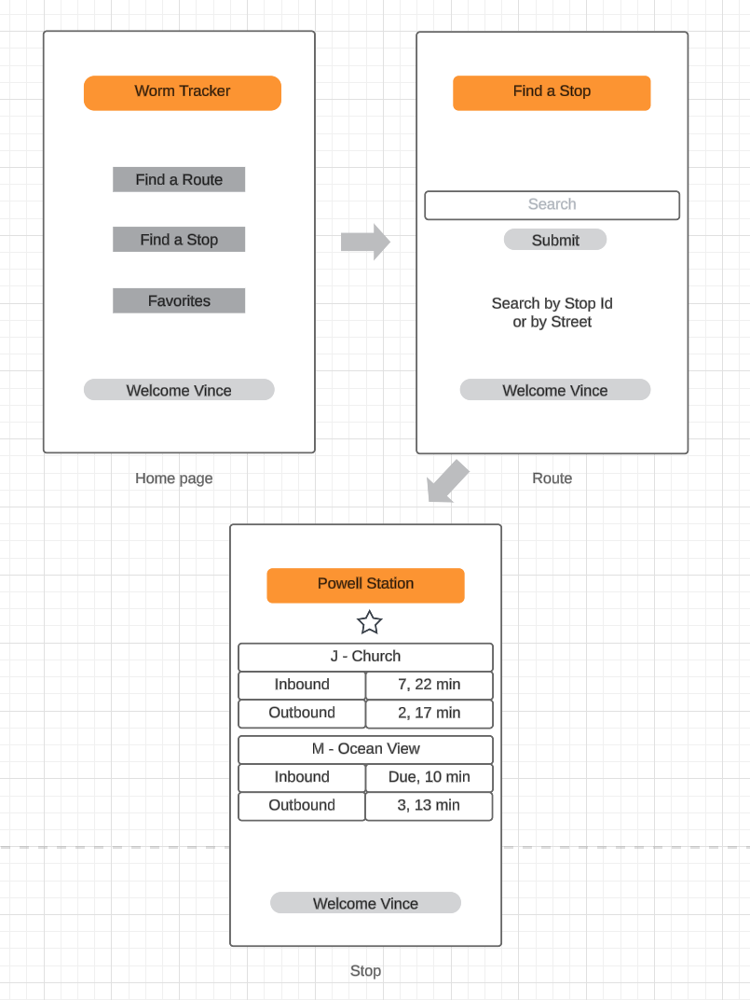
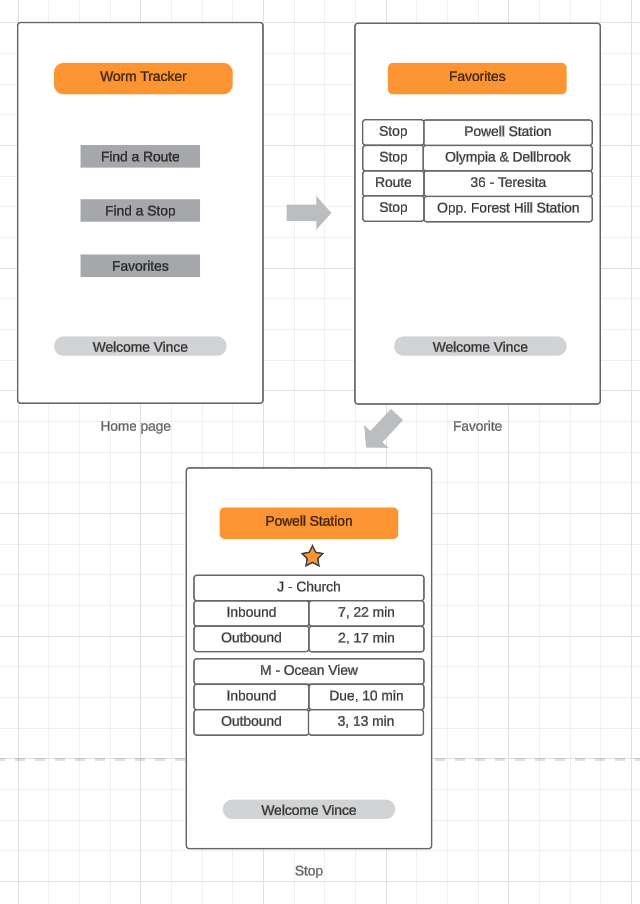
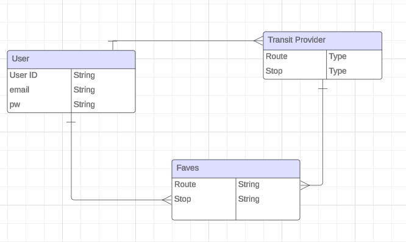

# Project 2

## Worm Tracker

## Overview
A quick and easy transit arrival checker with the ability to favorite stops and routes with a focus on mobile useage. 

## Wireframes
Sign In Flow  

Route Flow  

Stop Flow  

Favorites  

ERD  

## User Stories
As a user, I want the ability to... 
  - sign up. 
  - sign in. 
  - sign out. 
  - look up arrivals by agency, route, and stop.
  - favorite stops and routes.
  - view all of my favorites in a list.
  - remove favorites.

Bonuses
  - search bar functionality
  - other transit agencies.
  - any transit announcements.
  - provide feedback.

